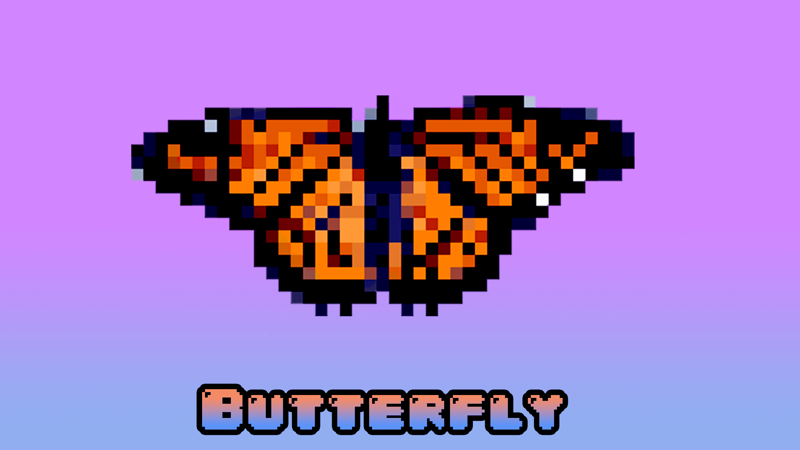

# Butterfly

<b>OpenGL Gui for glfw with designer/editor feature</b>

<h2>Work in progress...<h2>
<h3>Dependencies:</h3>

GLFW

glad (for opengl functionality loading ,will try to remove this dependency later)

<h4>Note:</h4>

Butterfly is only for gui it can't load in data like images for that you can use something like stb_image

  
<h4>Current state:<h4>
<ul>
<li>Font loading (.fnt .bmp font atlases)</li>
<li>Basic class structure</li>
<li>Panels</li>
<li>Text/Image Buttons (click events)</li>
</ul>

